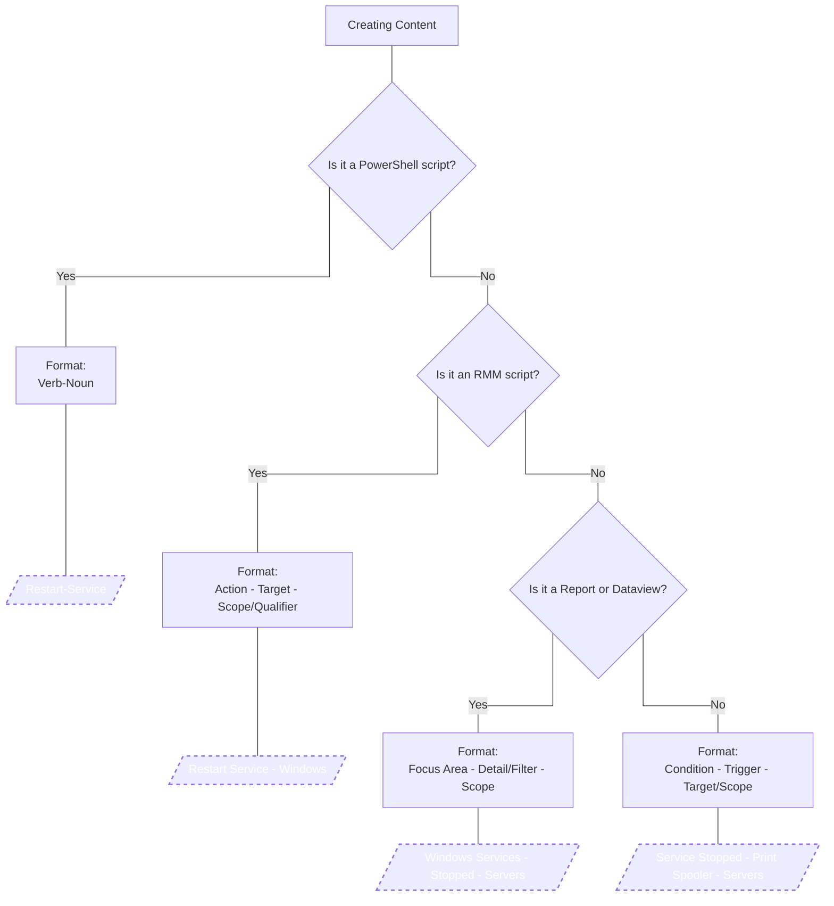

## 🟦 PowerShell Scripts

**Format:**

```
Verb-Noun [-Qualifier] [-Target]
```

**Examples:**

* `Restart-Service -IfHung`
* `Clear-EventLog -OlderThan30Days`
* `Install-Chrome`
* `Update-BIOS -Dell`
* `Set-TimeZone -UTC`

## 🟨 RMM Scripts

**Format:**

```
[Action] - [Target] - [Scope/Qualifier]
```

**Examples:**

* `Clear Temp Files - Workstations - All`
* `Install Chrome - All Users`
* `Restart Print Spooler - If Stopped`
* `Update BIOS - Dell Systems`


## 🟩 Reports / Dataviews

**Format:**

```
[Focus Area] - [Detail/Filter] - [Scope]
```

**Examples:**

* `Patch Compliance - Missing Updates - Workstations`
* `Ticket Volume - Monthly`
* `Asset Inventory - ClientX`
* `Service Performance - Tier 1`

## 🟥 Monitors

**Format:**

```
[Condition] - [Trigger/Threshold] - [Target/Scope]
```

**Examples:**

* `Disk Space Low - Below 10% - System Drive`
* `Service Stopped - Print Spooler`
* `Login Failures - Excessive - RDP`
* `Patch Window Missed - All Workstations`

## 🧾 Quick Reference Summary

| Content Type    | Format Template                                      | Example                                 |
| --------------- | ---------------------------------------------------- | --------------------------------------- |
| **PowerShell**  | `Verb-Noun [-Qualifier] [-Target]`                   | `Remove-TempFiles`, `Set-TimeZone -UTC` |
| **RMM Script**  | `[Action] - [Target] - [Scope/Qualifier]`            | `Install Chrome - All Users`            |
| **Report/View** | `[Focus Area] - [Detail/Filter] - [Scope]`           | `Asset Inventory - Workstations`        |
| **Monitor**     | `[Condition] - [Trigger/Threshold] - [Target/Scope]` | `CPU Usage High - 95% - 5 Min Avg`      |