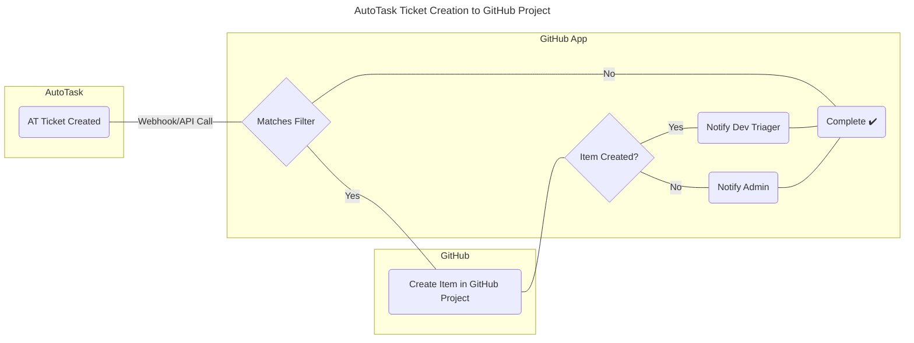
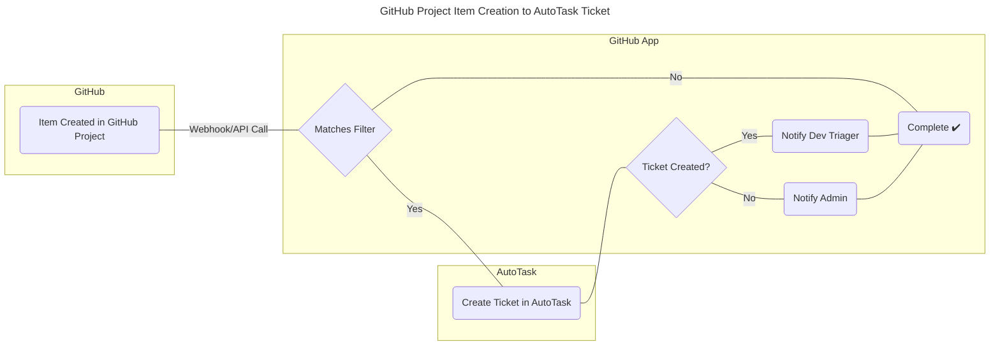

```mermaid
---
title: AutoTask Ticket Creation to GitHub Project
---
flowchart LR
    subgraph at [AutoTask]
        ticketCreated("AT Ticket Created")
    end
    
    subgraph gh [GitHub]
        createItem("Create Item in GitHub Project")
    end

    subgraph gha [GitHub App]
        ticketCreated ---|Webhook/API Call| matchFilter{Matches Filter}
        matchFilter ---|No| complete("Complete ✔️")
        matchFilter ---|Yes| createItem
        createItem---createItemCheck{"Item Created?"}
        createItemCheck ---|Yes| createItemSuccess("Notify Dev Triager") --- complete
        createItemCheck ---|No| notifyAdmin("Notify Admin") --- complete
    end
```

---

```mermaid
---
title: GitHub Project Item Creation to AutoTask Ticket
---
flowchart LR
    subgraph gh [GitHub]
        itemCreated("Item Created in GitHub Project")
    end

    subgraph at [AutoTask]
        createTicket("Create Ticket in AutoTask")
    end

    subgraph gha [GitHub App]
        itemCreated ---|Webhook/API Call| matchFilter{Matches Filter}
        matchFilter ---|No| complete("Complete ✔️")
        matchFilter ---|Yes| createTicket
        createTicket---createTicketCheck{"Ticket Created?"}
        createTicketCheck ---|Yes| createTicketSuccess("Notify Dev Triager") --- complete
        createTicketCheck ---|No| notifyAdmin("Notify Admin") --- complete
    end
```
