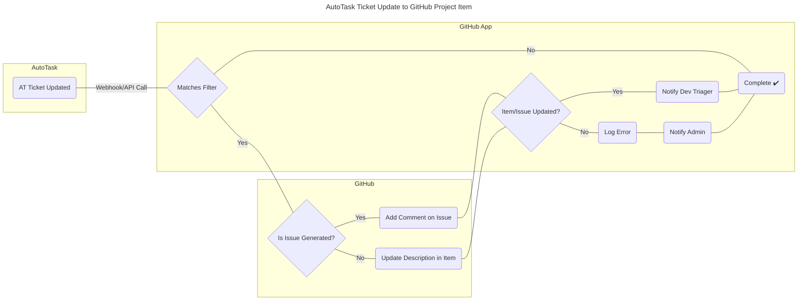
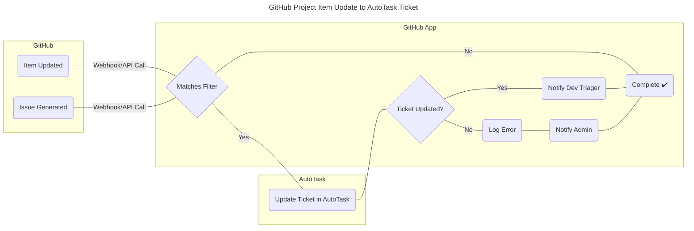

```mermaid
---
title: AutoTask Ticket Update to GitHub Project Item
---
flowchart LR
    subgraph at [AutoTask]
        ticketUpdated("AT Ticket Updated")
    end

    subgraph gh [GitHub]
        isIssueGenerated{"Is Issue Generated?"}
        updateDescription("Update Description in Item")
        commentIssue("Add Comment on Issue")
    end

    subgraph gha [GitHub App]
        ticketUpdated ---|Webhook/API Call| matchFilter{Matches Filter}
        matchFilter ---|No| complete("Complete ✔️")
        matchFilter ---|Yes| isIssueGenerated
        isIssueGenerated ---|No| updateDescription
        isIssueGenerated ---|Yes| commentIssue
        commentIssue & updateDescription---updateItemCheck{"Item/Issue Updated?"}
        updateItemCheck ---|Yes| updateItemSuccess("Notify Dev Triager") --- complete
        updateItemCheck ---|No| updateItemError("Log Error") --- notifyAdmin("Notify Admin") --- complete
    end
```

---

```mermaid
---
title: GitHub Project Item Update to AutoTask Ticket
---
flowchart LR
    subgraph gh [GitHub]
        itemUpdated("Item Updated")
        issueGenerated("Issue Generated")
    end

    subgraph at [AutoTask]
        updateTicket("Update Ticket in AutoTask")
    end

    subgraph gha [GitHub App]
        itemUpdated & issueGenerated ---|Webhook/API Call| matchFilter{Matches Filter}
        matchFilter ---|No| complete("Complete ✔️")
        matchFilter ---|Yes| updateTicket
        updateTicket---updateTicketCheck{"Ticket Updated?"}
        updateTicketCheck ---|Yes| updateTicketSuccess("Notify Dev Triager") --- complete
        updateTicketCheck ---|No| updateTicketError("Log Error") --- notifyAdmin("Notify Admin") --- complete
    end
```